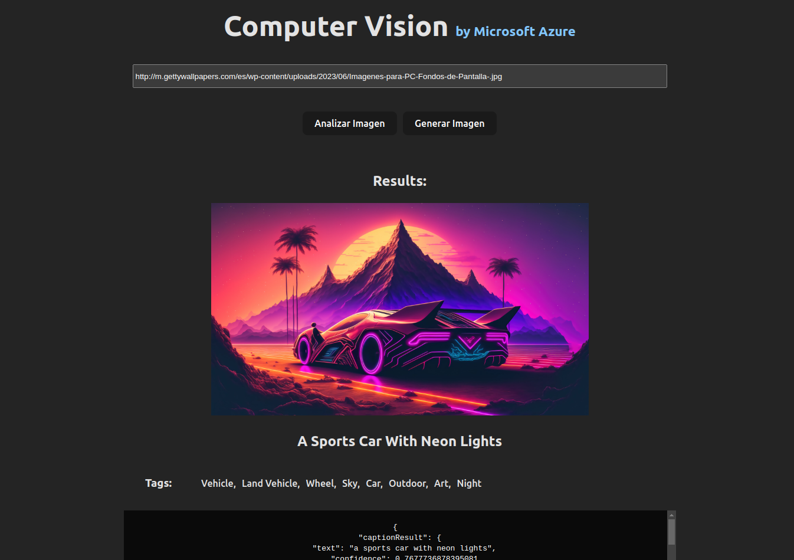

# Challenge project - Image analysis and generation capabilities with Azure AI



This project demonstrates the ability to develop an intelligent web application that integrates Computer Vision functionalities, leveraging Azure AI Vision and OpenAI image services.

Check out the site here: [https://analyze-generate-images-azure-ai.vercel.app](https://analyze-generate-images-azure-ai.vercel.app)

---

## Features

In this project, it demonstrates the ability to:

- Integrate into the application the most recent functionalities of Image Analysis 4.0 based on the technology of Microsoft Florence's large-scale basic model.
- Enrich the solution with generative artificial intelligence functionalities.
- Create a CI/CD pipeline with GitHub actions to implement the application in the cloud as an Azure static web application.

---

## Build Setup

```bash
# clone repository
git clone https://github.com/Johndev85/analyze-and-generate-images-with-Azure-AI.git

# go project file
 cd analyze-and-generate-images-with-Azure-AI

# install dependencies
npm install

# serve with hot reload at localhost:5173/
npm run dev

# build for production with minification
npm run build

```

---

## Technologies

- React
- vitejs
- Computer Vision - Microsoft Azure IA (require Azure account)
- Static web Apps - Microsoft Azure (require Azure account)

---

## Contribute

If you want to contribute with this project, just make a Pull Request explaining the improving ✨.

---

## License

The MIT License (MIT)

---
